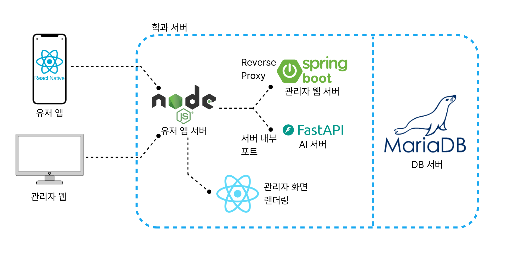

# team-ONE — User Backend

> `src/user-backend` | 팀 프로젝트 매칭 플랫폼의 사용자용 Node.js 백엔드 서버

---

## 📌 프로젝트 한 줄 요약

팀원을 찾고 프로젝트를 개설하며 **실시간 채팅·이력서 공유·AI 팀원 추천**으로 협업할 수 있는 팀 매칭 플랫폼의 백엔드 서버

---

## 🖼️ 아키텍처 다이어그램



---

## ✨ 주요 기능

### 인증
- 이메일/비밀번호 로그인 및 회원가입
- bcrypt 비밀번호 해시, JWT 발급 (`jsonwebtoken`)
- HTTP `Authorization: Bearer` 헤더와 WebSocket `?token=` 쿼리 파라미터를 모두 지원하는 통합 인증 미들웨어

### 프로젝트
- 프로젝트 생성·수정·삭제·완료 처리
- 키워드 기반 프로젝트 검색
- 공모전 연계 목록 조회

### AI 팀원 추천
- **FastAPI 서버 (port 8091)** 와 연동해 사용자 이력서·프로필 데이터를 전달
- 프로젝트 요구사항 및 우선순위(priority1 ~ 3) 기반 매칭 스코어 계산
- 상위 4명의 추천 팀원 정보 반환 및 DB 저장

### 실시간 채팅 (WebSocket)
- **express-ws** 기반 실시간 메시지 송수신, DB 저장, 방 전체 브로드캐스트
- 프로젝트 초대 메시지 (`project_invite` 타입) WebSocket 전송
- 이력서 카드 공유 (`resume` 타입) WebSocket 전송
- 파일·이미지 첨부 업로드 (Multer, 로컬 디스크)

### 채팅 (REST)
- 1:1 다이렉트 채팅방 생성
- 채팅 목록 조회, 방 내 메시지 히스토리 조회, 채팅 메뉴 조회
- 프로젝트 초대 수락, 사용자 신고

### 마이페이지 / 이력서
- 마이페이지 정보 조회
- 프로필 수정, 이력서 수정
- 특정 유저 이력서 조회

### 관리자 서버 통합
- Spring Boot 어드민 서버를 **자식 프로세스**로 구동
- `/admin/*` 요청을 Spring Boot (port 10000)로 프록시 (GET HTML 요청은 React SPA 반환)
- React 어드민 프론트엔드 정적 파일 서빙 및 SPA fallback 처리

---

## 🛠️ 기술 스택

| 분류 | 기술 |
|---|---|
| Runtime | Node.js |
| Framework | Express 5 |
| Auth | JWT (`jsonwebtoken`), bcrypt |
| Database | MySQL (connection pool) |
| Real-time | express-ws (WebSocket) |
| File Upload | Multer (로컬 디스크) |
| Proxy | http-proxy-middleware → Spring Boot |
| Logging | Winston, winston-daily-rotate-file |
| Security | sanitize-html (XSS 방지) |
| AI 연동 | FastAPI (port 8091, 외부 서비스) |

---

## 🏗️ 아키텍처

```
클라이언트
    │
    ▼
Node.js Express (port 60002)
    ├── /api/*          → Node.js 로컬 라우터
    ├── /admin/*  API   → http-proxy-middleware → Spring Boot (port 10000, child process)
    ├── /admin/*  HTML  → React Admin SPA (정적 파일)
    └── /uploads/*      → 업로드 파일 정적 서빙
    
Node.js Express
    ├── MySQL (Connection Pool)
    └── FastAPI (port 8091)  ← AI 팀원 추천
```

### 인증 흐름
1. 로그인 시 bcrypt로 비밀번호 검증 후 JWT 발급
2. HTTP 요청: `Authorization: Bearer <token>` 헤더에서 토큰 추출
3. WebSocket 연결: `?token=<token>` 쿼리 파라미터에서 토큰 추출
4. `verifyToken` 미들웨어가 토큰을 검증하고 `req.user`에 payload 주입

---

## 📁 프로젝트 구조

```
src/user-backend/
├── app.js                     # 엔트리 포인트 — 미들웨어, WS 라우트, Spring Boot 프로세스 관리
├── package.json
├── router/
│   ├── rootRouter.js          # GET /api/mainPage
│   ├── authRouter.js          # /api/auth/*
│   ├── projectRouter.js       # /api/project/*
│   ├── myPageRouter.js        # /api/myPage/*
│   ├── resumeRouter.js        # /api/resume/*
│   ├── chatRouter.js          # /api/chat/* (REST)
│   └── chatUploadRouter.js    # POST /api/chatUpload/upload
└── lib/
    ├── auth/
    │   ├── login.js
    │   └── signUp.js
    ├── chat/
    │   ├── accept.js           # 프로젝트 초대 수락
    │   ├── invite.js           # WS: 프로젝트 초대 메시지
    │   ├── list.js             # 채팅 목록 조회
    │   ├── menu.js             # 채팅 메뉴
    │   ├── message.js          # WS: 실시간 메시지
    │   ├── private.js          # 1:1 채팅방 생성
    │   ├── report.js           # 사용자 신고
    │   ├── resume.js           # WS: 이력서 공유
    │   ├── room.js             # 메시지 히스토리 조회
    │   ├── upload.js           # 파일 업로드 처리 + 브로드캐스트
    │   └── wsManager.js        # WebSocket 연결 풀 관리
    ├── myPage/
    │   ├── editProfile.js
    │   └── editResume.js
    ├── project/
    │   ├── complete.js
    │   ├── contest.js
    │   ├── create.js
    │   ├── delete.js
    │   ├── detail.js
    │   ├── edit.js
    │   ├── recommand.js        # AI 팀원 추천 (FastAPI 연동)
    │   └── search.js
    ├── mainPage.js
    ├── myPage.js
    ├── resume.js
    └── util/
        ├── authMiddleware.js   # JWT 검증 (HTTP + WS 겸용)
        ├── db.js               # MySQL Connection Pool
        ├── logger.js           # Winston 로거
        └── sanitize.js         # XSS 방지 객체 정제
```

---

## 🔌 API 엔드포인트

> `🔒` 표시된 엔드포인트는 JWT 인증이 필요합니다.

### 인증
| 메서드 | 경로 | 설명 |
|---|---|---|
| POST | `/api/auth/login` | 로그인 (JWT 발급) |
| POST | `/api/auth/signUp` | 회원가입 |

### 메인
| 메서드 | 경로 | 설명 |
|---|---|---|
| GET 🔒 | `/api/mainPage` | 메인 페이지 데이터 조회 |

### 프로젝트
| 메서드 | 경로 | 설명 |
|---|---|---|
| GET | `/api/project/contest` | 공모전 목록 조회 |
| POST 🔒 | `/api/project/create` | 프로젝트 생성 |
| PATCH 🔒 | `/api/project/edit/:projectId` | 프로젝트 수정 |
| GET 🔒 | `/api/project/detail/:projectId` | 프로젝트 상세 조회 |
| DELETE 🔒 | `/api/project/delete/:projectId` | 프로젝트 삭제 |
| PATCH 🔒 | `/api/project/complete/:projectId` | 프로젝트 완료 처리 |
| POST 🔒 | `/api/project/search` | 프로젝트 검색 |
| POST 🔒 | `/api/project/recommand/:projectId` | AI 팀원 추천 |

### 마이페이지 / 이력서
| 메서드 | 경로 | 설명 |
|---|---|---|
| GET 🔒 | `/api/myPage` | 마이페이지 조회 |
| PATCH 🔒 | `/api/myPage/profile/edit` | 프로필 수정 |
| PATCH 🔒 | `/api/myPage/resume/edit` | 이력서 수정 |
| GET 🔒 | `/api/resume/:userId` | 특정 유저 이력서 조회 |

### 채팅 (REST)
| 메서드 | 경로 | 설명 |
|---|---|---|
| POST 🔒 | `/api/chat/private` | 1:1 채팅방 생성 |
| GET 🔒 | `/api/chat/list` | 채팅 목록 조회 |
| GET 🔒 | `/api/chat/room/:roomId` | 방 내 메시지 히스토리 |
| GET 🔒 | `/api/chat/menu/:roomId` | 채팅 메뉴 정보 |
| POST 🔒 | `/api/chat/accept` | 프로젝트 초대 수락 |
| POST 🔒 | `/api/chat/report` | 사용자 신고 |
| POST 🔒 | `/api/chatUpload/upload` | 파일 업로드 |

---

## ⚡ WebSocket 이벤트

WebSocket 연결 시 `?token=<JWT>` 쿼리 파라미터로 인증합니다.

| 엔드포인트 | 클라이언트 → 서버 payload | 서버 → 클라이언트 payload | 설명 |
|---|---|---|---|
| `WS /api/chat/message` | `{ roomId, content, contentType }` | `{ type: "NEW_MESSAGE", messageId, roomId, userId, content, contentType, date }` | 실시간 메시지 전송·브로드캐스트 |
| `WS /api/chat/invite` | `{ roomId, targetUserId, projectId }` | `{ type: "NEW_MESSAGE", contentType: "project_invite", content: { projectId, projectName, inviterId, inviterNickName } }` | 프로젝트 초대 전송 |
| `WS /api/chat/resume` | `{ roomId }` | `{ type: "NEW_MESSAGE", contentType: "resume", content: { userId, nickName, job, techStack, ... } }` | 이력서 카드 공유 |

---

## 🚨 트러블슈팅 및 설계 고민

### 1) WebSocket JWT 인증

- **문제**: Express의 HTTP 미들웨어(`Authorization` 헤더 기반)는 WebSocket handshake에 그대로 적용되지 않음
- **해결**: `verifyToken` 미들웨어를 HTTP 헤더와 WS 쿼리 파라미터(`?token=`) 양쪽을 모두 처리하도록 분기. `app.use('/api/chat/message', verifyToken)` 으로 WS 핸드셰이크 시점에 사전 검증

### 2) Spring Boot 자식 프로세스 통합

- **문제**: 사용자 백엔드(Node.js)와 어드민 백엔드(Spring Boot)를 별도로 실행해야 하면 배포·운영 복잡도가 증가
- **해결**: `child_process.spawn`으로 Spring Boot JAR을 Node.js가 직접 구동, `/admin/*` API 요청은 `http-proxy-middleware`로 내부 포트(10000)에 프록시. Node.js 한 프로세스로 전체 서버를 통합 관리

### 3) AI 추천 FastAPI 분리

- **문제**: 팀원 매칭 스코어 계산(ML 모델)을 Node.js에서 직접 처리하기 어려움
- **해결**: Python FastAPI 서버(8091)를 별도 마이크로서비스로 분리. Node.js는 사용자·프로젝트 데이터를 조합해 FastAPI에 POST 요청만 하고, 결과를 받아 DB에 저장 후 응답

### 4) XSS 방지 레이어

- **문제**: 사용자 입력이 DB에 저장되고 WebSocket을 통해 브로드캐스트될 때 XSS 공격 가능성
- **해결**: `sanitize.sanitizeObject()`로 req.body 및 WS 수신 JSON의 모든 문자열 필드에 `sanitize-html` 적용 (모든 HTML 태그 제거). REST API와 WS 핸들러 양쪽에 일관 적용

---

## 🧠 설계 의도

- **단일 `verifyToken` 미들웨어**가 HTTP와 WebSocket 인증을 모두 처리해 인증 로직 중복 제거
- **wsManager** 모듈이 userId 기준으로 WS 연결 풀을 관리해 특정 방의 모든 연결에 브로드캐스트하는 로직을 중앙화
- **Spring Boot 자식 프로세스**를 Node.js가 관리해 단일 포트(60002)로 전체 서비스를 노출, SIGTERM/SIGINT 시 graceful shutdown으로 자식 프로세스도 함께 종료

---

## 🚀 로컬 실행

### 사전 요구사항
- Node.js 18+, MySQL 8+
- Python FastAPI 서버 (팀원 추천 기능 사용 시)
- Java 17+ (어드민 기능 사용 시)

### 실행

```bash
cd src/user-backend
cp .env.example .env       # 환경변수 설정
npm install
node app.js                # http://0.0.0.0:60002
```

---

## 🔑 환경변수

```env
PORT=60002
HOST=0.0.0.0

# MySQL
DB_HOST=localhost
DB_PORT=3306
DB_USER=team-ONE
DB_PASSWORD=team-ONE123
DB_DATABASE=team-ONE

# JWT
JWT_SECRET=your-secret-key
JWT_EXPIRES_IN=1h
```

---

## 📄 라이선스

MIT
